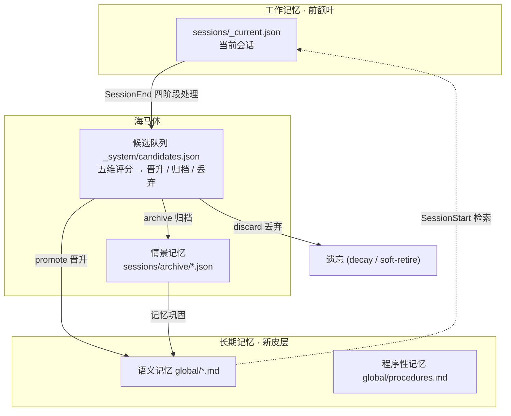

# 🧠 Hippocampus Agent Memory System

> 仿人类大脑与海马体的 AI Agent 分层认知记忆系统
>
> A hippocampus-inspired layered cognitive memory system for AI Agents

[](LICENSE)
[](https://www.python.org/)
[](https://www.gnu.org/software/bash/)

---

## 👥 这个项目适合谁？

- **搭 Agent / RAG / 自动化流程的开发者**：Agent 每次对话"聊完就忘"？这个系统给它装上跨会话记忆
- **想让编码 Agent 记住你的偏好和踩过的坑**：配置成 SessionStart / SessionEnd Hook，自动记忆、自动巩固
- **对"AI 记忆与认知架构"感兴趣的学习者**：一份可运行的分层记忆实现，直接映射认知科学概念

**不适合**：需要大规模语义向量检索的生产系统（本项目基于关键词检索，见「当前局限」）。

---

## 🤔 为什么需要这个系统？

所有大语言模型本质上是**无状态的**。每次对话都像第一次见面。上下文窗口是唯一的"记忆"，但它：
- 有长度限制
- 满了就丢弃旧内容
- 不会判断什么该记住、什么该遗忘
- 不会在后台"消化"和"巩固"信息

这个项目尝试解决这个问题：**让 AI Agent 拥有类似人类海马体的记忆系统**。

---

## 🏗️ 认知架构

```
┌─────────────────────────────────────────────┐
│              长期记忆 (新皮层)                 │
│   语义记忆: preferences / patterns / lessons  │
│   程序性记忆: procedures                      │
│   寿命: 长期，按需检索                         │
├─────────────────────────────────────────────┤
│              候选队列 (海马体)                  │
│   _system/candidates.json                    │
│   五维评分 → 晋升 / 归档 / 丢弃                │
│   寿命: 临时，最多 3 个评估周期                 │
├─────────────────────────────────────────────┤
│              情景记忆 (海马体)                  │
│   sessions/archive/*.json                    │
│   寿命: 天到月                                 │
├─────────────────────────────────────────────┤
│              工作记忆 (前额叶)                  │
│   sessions/_current.json                     │
│   寿命: 当前会话                                │
└─────────────────────────────────────────────┘
```

### 可视化架构图



### 认知科学映射

| 人类记忆系统 | 脑区 | 系统实现 |
|-------------|------|---------|
| 工作记忆 (Working Memory) | 前额叶皮层 | `sessions/_current.json` |
| 情景记忆 (Episodic Memory) | 海马体 | `sessions/archive/*.json` |
| 记忆巩固 (Consolidation) | 海马体→新皮层 | `_system/candidates.json` |
| 语义记忆 (Semantic Memory) | 新皮层 | `global/*.md` |
| 程序性记忆 (Procedural Memory) | 基底节/小脑 | `global/procedures.md` |
| 记忆检索 (Recall) | 线索回忆 | `retrieve` 命令 |
| 再巩固 (Reconsolidation) | 记忆更新 | `recall-outcome` 命令 |
| 遗忘 (Forgetting) | 记忆消退 | `decay` + `soft-retire` |

---

## ✨ 核心特性

### 🔄 完整记忆生命周期

```
SessionStart 检索
    ↓
任务执行 (Working Memory)
    ↓
SessionEnd 四阶段处理:
    1. SUMMARIZE  — 摘要 + 情景构建 + 候选生成
    2. EVALUATE   — 五维评分 → promote / archive / discard
    3. COMPRESS   — L1去重 → L2抽象 → L3重组
    4. CLEANUP    — 清理 + 统计更新
```

### 🎯 五维记忆评分

| 维度 | 权重 | 含义 |
|------|------|------|
| **通用性** (Generality) | 25% | 是否跨项目适用 |
| **可操作性** (Actionability) | 25% | 是否能指导未来行动 |
| **持久性** (Durability) | 20% | 随时间衰减的速度 |
| **新颖性** (Novelty) | 15% | 是否与已有记忆重复 |
| **特异性** (Specificity) | 15% | 是否足够具体 |

### 📦 三层记忆压缩

- **L1 去重**: Jaccard 相似度 > 0.7 → 合并重复条目
- **L2 抽象**: 3+ 条相似经验 → 提炼通用原则
- **L3 重组**: 过大/过小的文件类别 → 建议拆分或合并

### 🛡️ 安全设计

- 自动检测并拒绝写入 API Key / Token / Password
- Open-loop 追踪：未解决的问题不会被遗忘
- 冲突标记而非静默覆盖
- 软退休：遗忘 = 降低召回概率，非物理删除
- 记忆从不取代用户指令

---

## 🚀 快速开始

### 前提条件

- Python 3.8+
- Bash 4.0+
- (可选) Claude Code 或类似的 Hook 系统

### 1. 初始化记忆目录

```bash
# 克隆项目
git clone https://github.com/YOUR_USERNAME/hippocampus-agent-memory.git
cd hippocampus-agent-memory

# 初始化记忆存储目录
mkdir -p ~/.claude/memory/{global,sessions/archive,_system}

# 复制示例结构
cp -r examples/memory-structure-example/* ~/.claude/memory/
```

### 2. 配置

编辑 `memory-config.json` 调整评分权重、压缩阈值、Token 预算等参数。

### 3. 手动测试

```bash
# 健康检查
python memory-core.py health-check

# 检索相关记忆
python memory-core.py retrieve --scope global

# 写入工作事件
python memory-core.py record-event \
  --event '{"kind":"observation","content":"发现了一个重要模式","importance":0.8}'

# 查看工作状态
python memory-core.py working-state --limit 10
```

### 4. 接入 Hook 系统

在 Claude Code 的 `settings.json` 中添加：

```json
{
  "hooks": {
    "SessionStart": [{
      "hooks": [{
        "type": "command",
        "command": "\"$HOME/hippocampus-agent-memory/memory-load.sh\"",
        "timeout": 15
      }]
    }],
    "SessionEnd": [{
      "hooks": [{
        "type": "command",
        "command": "\"$HOME/hippocampus-agent-memory/memory-save.sh\"",
        "timeout": 120
      }]
    }]
  }
}
```

---

## 📁 项目结构

```
hippocampus-agent-memory/
├── memory-core.py          # 核心智能引擎 (~1585 行)
├── memory-load.sh          # SessionStart: 记忆检索
├── memory-save.sh          # SessionEnd: 四阶段生命周期
├── memory-lib.sh           # 共享 Bash 工具库
├── memory-health.py        # 只读健康检查
├── memory-config.json      # 评分/压缩/衰减参数配置
├── docs/
│   ├── AGENT-MEMORY-SYSTEM-REPORT.md  # 完整技术报告（中文）
│   └── RELEASE-CHECKLIST.md           # 发布检查清单
├── examples/
│   └── memory-structure-example/      # 记忆目录结构模板
├── CHANGELOG.md                       # 迭代变更记录
├── README.md
├── LICENSE
└── .gitignore
```

---

## 🔧 CLI 命令速查

```bash
# 核心操作
python memory-core.py summarize --transcript FILE --session ID --project NAME
python memory-core.py evaluate --candidates JSON --scope global
python memory-core.py compress --scope global [--dry-run]
python memory-core.py promote --entry JSON --scope global --file lessons.md
python memory-core.py stats --scope global
python memory-core.py decay --scope global
python memory-core.py retrieve --scope global [--query "keyword"] [--cwd /path]

# 维护操作
python memory-core.py record-event --event JSON
python memory-core.py working-state --limit 20
python memory-core.py record-recall --file NAME --scope global
python memory-core.py recall-outcome --file NAME --outcome helpful
python memory-core.py detect-conflicts --entries JSON
python memory-core.py soft-retire --id ID --reason "outdated"
python memory-core.py revise-memory --id ID --state superseded
python memory-core.py health-check
python memory-core.py rebuild-index
```

---

## 📖 详细文档

完整的设计哲学、认知科学映射、问题修复记录和操作手册，请参阅：

👉 **[AGENT-MEMORY-SYSTEM-REPORT.md](docs/AGENT-MEMORY-SYSTEM-REPORT.md)**（中文，878 行）

变更历史见 **[CHANGELOG.md](CHANGELOG.md)**；每次发布前请走一遍 **[发布检查清单](docs/RELEASE-CHECKLIST.md)**。

---

## ⚠️ 当前局限

这是一个**学习项目和原型**，已知限制：
- 基于关键词检索，尚未实现语义向量检索
- Project 级别和 Global 级别共用 index，未完全隔离
- 尚无批量自动化测试

欢迎 Issue 和 PR！

---

## 🤝 致谢

本项目由 AI（Claude Code）辅助开发，遵循"人类设计架构，AI 实现细节"的协作模式。

核心设计思想归功于认知神经科学中关于海马体记忆巩固的研究，特别是：
- 工作记忆 → 情景记忆 → 语义记忆的层级模型
- 记忆再巩固（Reconsolidation）理论
- 遗忘的衰减模型（Decay Theory）

---

## 📄 许可证

MIT License — 详见 [LICENSE](LICENSE)

---

*"记忆不是记录过去，而是重构过去。遗忘不是 bug，是 feature。"*
